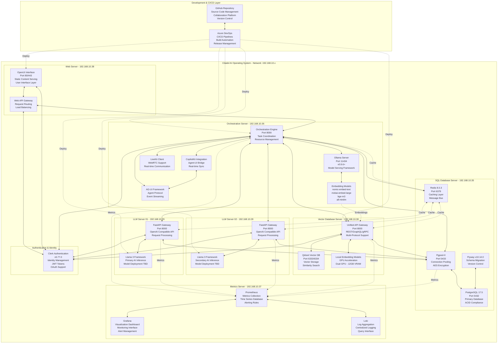

# Citadel AI Operating System - Updated Tech Stack Architecture

**Document Version:** 2.0  
**Date:** 2025-07-27  
**Author:** Manus AI  
**Project:** Citadel Alpha  
**Purpose:** Pure Technical Stack Architecture Specification  

---

## Executive Summary

The Citadel AI Operating System represents a sophisticated distributed architecture built upon modern cloud-native technologies and AI frameworks. This updated technical specification defines the complete technology stack, component interactions, and architectural patterns that form the foundation of the Citadel platform. The architecture has been updated to incorporate Llama 3 as the primary AI framework, Azure DevOps and GitHub for CI/CD operations, while removing deprecated components such as Proactor Agent and vLLM.

The system operates across seven dedicated servers within a private network infrastructure, each optimized for specific computational workloads and service responsibilities. The architecture emphasizes high availability, scalability, and performance through distributed processing, intelligent load balancing, and comprehensive monitoring capabilities.

---

## System Architecture Overview

The Citadel architecture follows a microservices pattern with clear separation of concerns across multiple specialized servers. Each server operates within the 192.168.10.x network segment and provides specific capabilities to the overall system ecosystem.

---

## Core Technology Stack

### Operating System & Runtime Environment

The entire Citadel infrastructure operates on Ubuntu Server 24.04 LTS, providing a stable and secure foundation for all system components. This choice ensures long-term support, security updates, and compatibility with modern containerization and orchestration technologies. Each server maintains a consistent Python 3.12.3 runtime environment deployed within isolated virtual environments located at `/opt/citadel/env`, ensuring dependency isolation and version consistency across the distributed system.

The system architecture employs `agent0` as the standardized root user across all servers, simplifying administrative operations and maintaining consistent security policies throughout the infrastructure. This approach enables centralized user management while preserving the ability to implement server-specific security configurations as needed.

### AI Inference Framework

The updated architecture centers around **Llama 3** as the primary AI inference framework, representing a significant evolution from the previous vLLM-based implementation. Llama 3 provides enhanced performance characteristics, improved model compatibility, and better resource utilization patterns that align with the distributed nature of the Citadel system. The framework supports dynamic model loading and unloading, enabling efficient resource management across the two dedicated LLM servers.

**Ollama v0.9.6+** serves as the model serving framework specifically deployed on the Orchestration Server (192.168.10.36). This deployment pattern enables centralized model management while distributing inference workloads across the dedicated LLM servers. Ollama provides sophisticated model lifecycle management, including automatic model downloads, version management, and resource optimization capabilities that ensure optimal performance across diverse model types and sizes.

The AI model deployment strategy follows a "TBD" (To Be Determined) approach, providing architectural flexibility to deploy various model types based on specific use case requirements. This approach enables the system to adapt to evolving AI model landscapes while maintaining consistent API interfaces and operational patterns.

### Database Architecture

The database layer implements a sophisticated multi-database architecture optimized for different data access patterns and performance requirements. **PostgreSQL 17.5** serves as the primary relational database, providing ACID compliance, advanced query optimization, and comprehensive data integrity features. The database operates on a dedicated server (192.168.10.35) with **Pgpool-II** connection pooling on port 5433, implementing AES encryption for secure connection management and load balancing across database connections.

**Redis 8.0.3** operates as both a high-performance caching layer and asynchronous message bus, enabling rapid data access and inter-service communication. The Redis deployment includes password-based authentication and network-specific service binding, ensuring secure access while maintaining the performance characteristics required for real-time operations.

**Flyway v10.14.0** provides database schema migration capabilities, enabling version-controlled database evolution and consistent deployment across development, staging, and production environments. The migration system supports rollback capabilities and maintains comprehensive audit trails of all schema changes.

### Vector Database & Embedding Systems

The vector database infrastructure centers around **Qdrant**, providing high-performance vector storage and similarity search capabilities essential for AI-powered applications. Qdrant operates on ports 6333/6334 with a unified API gateway supporting REST, GraphQL, and gRPC protocols, enabling diverse client integration patterns and performance optimization strategies.

The embedding generation system implements a hybrid architecture combining local and distributed embedding models. The Orchestration Server hosts four specialized embedding models through Ollama: **nomic-embed-text** for general text processing, **mxbai-embed-large** for high-dimensional embeddings, **bge-m3** for multi-lingual support, and **all-minilm** for lightweight processing requirements.

The Vector Database Server (192.168.10.30) includes dedicated GPU acceleration with dual GPU configuration providing 12GB total VRAM, enabling local embedding generation for performance-critical operations while maintaining the flexibility to route embedding requests to the centralized Ollama deployment based on load balancing and optimization requirements.

### Web Framework & API Architecture

The system implements **FastAPI** as the primary web framework across all service endpoints, providing high-performance HTTP/HTTPS APIs with comprehensive OpenAPI documentation and automatic request/response validation. Each LLM server operates FastAPI gateways on port 8000, implementing OpenAI-compatible API endpoints that ensure seamless integration with existing AI development tools and libraries.

The API architecture implements sophisticated request routing, load balancing, and circuit breaker patterns to ensure high availability and optimal performance distribution across the distributed infrastructure. Rate limiting and throttling mechanisms protect against overload conditions while maintaining fair resource allocation among concurrent users and applications.

### Frontend & User Interface Technologies

The frontend architecture incorporates modern frameworks designed for AI-powered applications and real-time user interactions. **AG-UI** serves as the primary agent protocol framework, implementing event-based communication patterns that enable seamless integration between AI agents and user-facing applications. This protocol supports both HTTP and binary communication channels, providing flexibility for different performance and latency requirements.

**CopilotKit** provides the agent-UI bridge functionality, enabling real-time synchronization between AI processing workflows and user interface components. This integration supports sophisticated workflow management, real-time updates, and interactive AI assistance patterns that enhance user experience and operational efficiency.

**LiveKit** client integration enables WebRTC-based real-time communication capabilities, supporting voice, video, and data streaming requirements for collaborative AI applications and multi-user interaction scenarios.

### Authentication & Identity Management

**Clerk v5.77.0** provides enterprise-grade authentication and identity management capabilities, supporting multiple authentication methods including JWT tokens, OAuth providers, and session-based authentication. The system implements role-based access control with fine-grained permission management, enabling secure access to different system components based on user roles and organizational requirements.

The authentication architecture integrates across all system components, providing single sign-on capabilities and centralized user management while maintaining the security isolation required for distributed system operations.

### Monitoring & Observability Stack

The monitoring infrastructure implements a comprehensive observability stack centered around **Prometheus** for metrics collection and time series data management. Prometheus operates with sophisticated alerting rules and service discovery mechanisms that automatically detect and monitor new service instances as the system scales.

**Grafana** provides advanced visualization dashboards and alert management interfaces, enabling real-time system monitoring and historical performance analysis. The dashboard configuration includes custom metrics for AI model performance, database operations, and system resource utilization patterns specific to AI workload characteristics.

**Loki** implements centralized log aggregation with advanced query capabilities, enabling efficient debugging, audit trail management, and system analysis across the distributed infrastructure. The logging system implements structured logging with correlation IDs, facilitating efficient troubleshooting and system optimization activities.

### CI/CD & Development Infrastructure

The development and deployment pipeline integrates **GitHub** and **Azure DevOps** to provide comprehensive source code management, collaboration, and automated deployment capabilities. GitHub serves as the primary source code repository platform, hosting the "Citadel Alpha" repository with advanced collaboration features including pull request workflows, code review processes, and branch protection policies.

**Azure DevOps** implements the CI/CD pipeline infrastructure with sophisticated build automation, testing frameworks, and release management capabilities. The pipeline supports automated deployment across all seven servers in the Citadel infrastructure, implementing blue-green deployment patterns and rollback capabilities to ensure zero-downtime updates and reliable system evolution.

The CI/CD architecture includes automated testing at multiple levels, including unit tests for individual components, integration tests for service interactions, and end-to-end tests for complete workflow validation. Security scanning and dependency vulnerability assessment are integrated into the pipeline, ensuring that all deployed code meets security and quality standards.

---

## Network Architecture & Service Communication

### Network Topology

The Citadel infrastructure operates within a private network segment (192.168.10.x) with each server assigned a static IP address optimized for its specific role and communication patterns. This network design provides security isolation while enabling high-performance inter-service communication through dedicated network channels.

The network architecture implements sophisticated service discovery mechanisms that enable dynamic service registration and health monitoring. Load balancing operates at multiple levels, including network-level distribution for incoming requests and application-level routing for optimal resource utilization across the distributed infrastructure.

### Inter-Service Communication Patterns

Service communication follows well-defined patterns optimized for different interaction types and performance requirements. Synchronous communication utilizes HTTP/HTTPS protocols with comprehensive error handling and retry mechanisms, while asynchronous communication leverages Redis-based message queues for workflow coordination and event-driven processing.

The communication architecture implements circuit breaker patterns to prevent cascade failures and maintain system stability during partial outages or performance degradation. Connection pooling and keep-alive mechanisms optimize network resource utilization while maintaining the responsiveness required for real-time AI applications.

### Security & Access Control

Network security implements multiple layers of protection including firewall rules, network segmentation, and encrypted communication channels. All inter-service communication utilizes TLS encryption with certificate-based authentication where appropriate, ensuring data protection during transit across the distributed infrastructure.

Access control policies implement the principle of least privilege, with each service granted only the minimum permissions required for its operational responsibilities. Authentication tokens include expiration policies and refresh mechanisms that balance security requirements with operational efficiency.

---

## Performance & Scalability Characteristics

### Performance Targets

The architecture is designed to achieve specific performance benchmarks that support real-time AI applications and high-throughput processing requirements. Embedding processing capabilities target 1,000+ embeddings per second through the distributed embedding infrastructure, while API response latency maintains sub-100 millisecond targets for most operations.

Database operations implement sophisticated caching strategies and connection pooling to achieve optimal query performance, with read operations typically completing within single-digit milliseconds and write operations maintaining ACID compliance while achieving high throughput rates.

### Scalability Patterns

The system architecture supports both vertical and horizontal scaling patterns depending on specific performance requirements and resource constraints. Individual servers can be upgraded with additional CPU, memory, and storage resources, while the distributed nature of the architecture enables adding additional servers for specific workload types.

Load balancing and service discovery mechanisms automatically adapt to infrastructure changes, ensuring that scaling operations do not require manual configuration updates or service interruptions. The database architecture supports read replicas and sharding strategies for scenarios requiring extreme scale.

### Resource Optimization

Resource utilization optimization operates at multiple levels, including intelligent model loading and unloading based on usage patterns, dynamic connection pool sizing based on current load, and sophisticated caching strategies that minimize redundant processing operations.

The monitoring infrastructure provides detailed resource utilization metrics that enable proactive capacity planning and optimization decisions. Automated alerting ensures that resource constraints are identified and addressed before they impact system performance or availability.

---

## Technology Version Matrix

| Component | Version | Port(s) | Server Location | Purpose |
|-----------|---------|---------|-----------------|---------|
| Ubuntu Server | 24.04 LTS | - | All Servers | Operating System |
| Python | 3.12.3 | - | All Servers | Runtime Environment |
| Llama 3 | Latest | TBD | 192.168.10.29, 192.168.10.28 | AI Inference Framework |
| Ollama | 0.9.6+ | 11434 | 192.168.10.36 | Model Serving |
| PostgreSQL | 17.5 | 5432 | 192.168.10.35 | Primary Database |
| Redis | 8.0.3 | 6379 | 192.168.10.35 | Cache & Message Bus |
| Qdrant | Latest | 6333/6334 | 192.168.10.30 | Vector Database |
| FastAPI | Latest | 8000 | Multiple Servers | Web Framework |
| Pgpool-II | Latest | 5433 | 192.168.10.35 | Connection Pooling |
| Flyway | 10.14.0 | - | 192.168.10.35 | Schema Migration |
| Prometheus | Latest | 9090 | 192.168.10.37 | Metrics Collection |
| Grafana | Latest | 3000 | 192.168.10.37 | Monitoring Dashboard |
| Loki | Latest | 3100 | 192.168.10.37 | Log Aggregation |
| Clerk | 5.77.0 | - | Distributed | Authentication |
| CopilotKit | Latest | - | 192.168.10.36 | Agent-UI Bridge |
| AG-UI | Latest | - | 192.168.10.36 | Agent Protocol |
| LiveKit | Latest | - | 192.168.10.36 | Real-time Communication |
| GitHub | Latest | - | External | Source Control |
| Azure DevOps | Latest | - | External | CI/CD Pipeline |

---

## Architecture Changes & Updates

### Removed Components

The updated architecture removes several components that were part of the previous implementation but are no longer required or have been superseded by more effective alternatives:

**Proactor Agent** has been completely removed from the architecture as its operational orchestration capabilities have been integrated into the enhanced Orchestration Server design. This consolidation reduces system complexity while maintaining the required coordination capabilities through more efficient architectural patterns.

**vLLM** has been replaced by the Llama 3 framework, which provides better performance characteristics and more flexible model deployment options. This change enables more efficient resource utilization and improved compatibility with the distributed architecture design.

### Enhanced Components

**Azure DevOps** integration provides comprehensive CI/CD capabilities that replace previous manual deployment processes. The integration includes automated testing, security scanning, and deployment orchestration across all servers in the Citadel infrastructure.

**GitHub** serves as the centralized source code repository with advanced collaboration features, replacing previous version control approaches with enterprise-grade capabilities including advanced security features, automated dependency management, and comprehensive audit trails.

### Flexible Model Architecture

The AI model deployment strategy has been updated to support "TBD" (To Be Determined) model configurations, providing architectural flexibility to adapt to evolving AI model requirements without requiring fundamental architecture changes. This approach enables rapid adoption of new model types while maintaining consistent operational patterns and API interfaces.

---

This updated technical architecture provides a comprehensive foundation for the Citadel AI Operating System, incorporating modern technologies, proven architectural patterns, and flexible design approaches that support both current requirements and future evolution of the platform.

